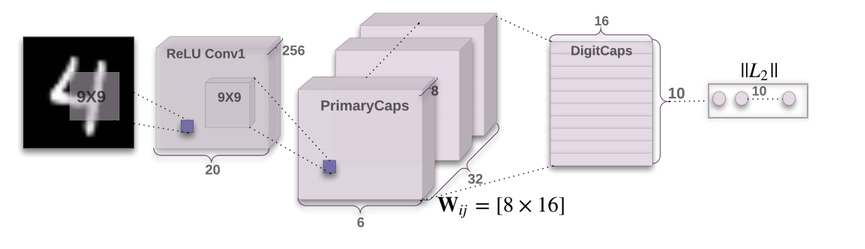
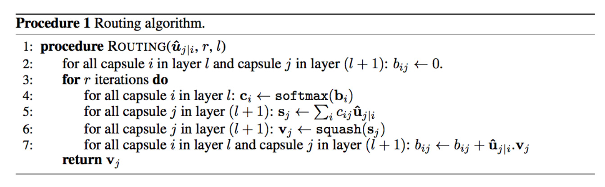

# Capsule Network with Dynamic Routing
#### Implemented with PyTorch
## Introduction
A capsule network [1] is a new type of neural network proposed by Geoffrey Hinton. Hinton argues that the convolution neural network has several problems; for example, they cannot handle the orientation information very well. With a capsule network, the neurons are gathered in a group called capsule, and they output a “vector” instead of scalars.

*Figure 1. Architecture of Capsule Network with dynamic routing*

Therefore, a capsule network can remember the “pose” of the object in images. For example, even when digits are overlapping, capsule networks seem to recognize them with good accuracy.

## Routing Algorithm

1. Firstly we initialize all logits between i,j pairs to 0
2. We run the below procedure for a fixed number of times
	1. We get all the coupling coefficients pairs i,j by softmax on logits
	2. We calculate the input to all j’s by (2)
	3. We calculate output by squashing (1) which we call as output
	4. We update the logits. We will see next how do we update
3. Return the output

We use dynamic routing to compute the output of a capsule.

## References
[1] Sabour, S., Frosst, N., & Hinton, G. E. (2017). Dynamic routing between capsules. In Advances in Neural Information Processing Systems (pp. 3859-3869).